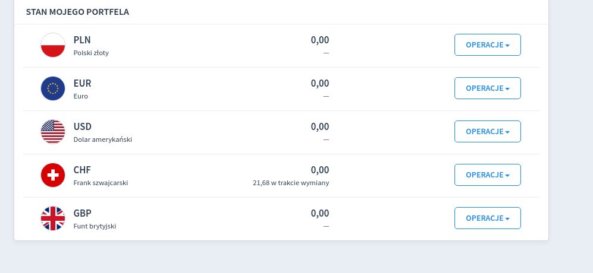

# Walutomat Money Loser
Using AI and cutting edge technology allowing you to surely and painfully slowly lose all your balance stored on Walutomat.pl.

## How to run?
1. Create an account on walutomat.pl
1. Obtain the ability to upload public RSA key (you will need to call Customer Service <3)
1. Follow the instructions here https://api.walutomat.pl/v2.0.0/#section/Overview/Getting-started
1. Fill API_KEY in .env file with your walutomat API key 
1. Copy and paster your public RSA key into the root dir of the project
1. Fill PRIVATE_KEY_FILENAME in .env with the filename of your RSA public key
1. run  `npm install`
1. run `make run`
1. watch your money wither away

## How it works
Idk, I wrote some lines of code and it started losing money instead of making, so I figured I will push this instead of trying to fix things.

## How it REALLY works
1. cancels all your active orders
1. for each currency you have money in it chooses random currency pair
1. places SELL order to match with best order of buying the currency
1. repeat

## Requirements
Idk try to run it and google the errors you encounter